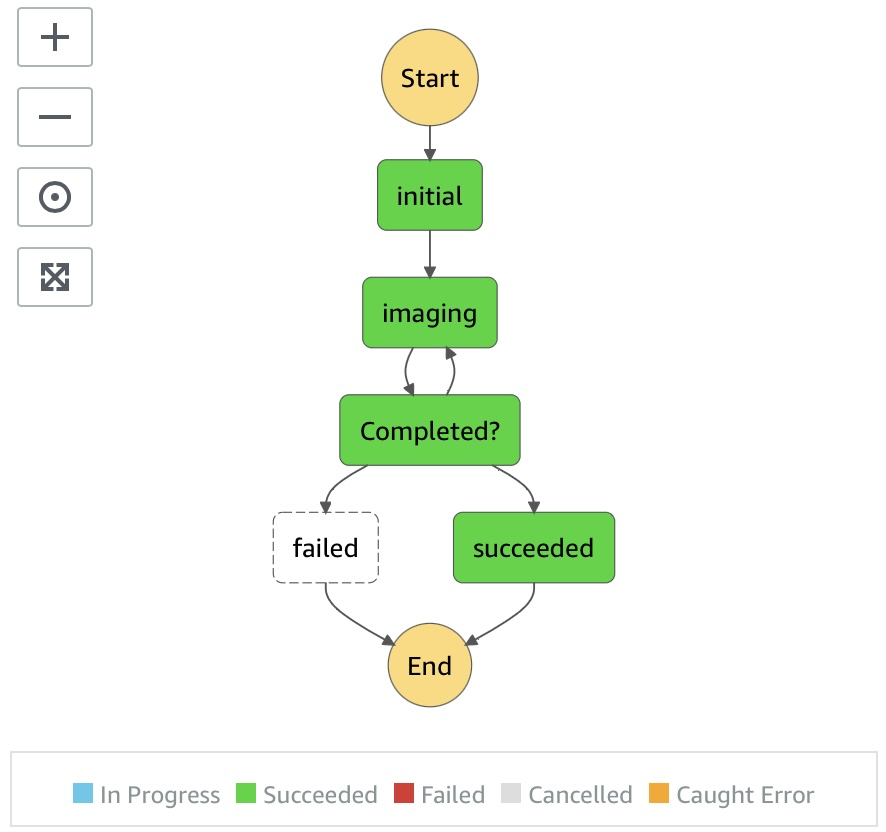

# Snap4n6


### Budget Event

```json
{
  "SnapshotID": "snap-0f3e60199f11889da"
}
```

### Budget Response

```
Snapshot ID: 	  snap-0f3e60199f11889da
API Quantity: 	104
Download Size: 	0.05 GB
Volume Size: 	  1 GB
```

### Image Event

```json
{
  "SnapshotID": "snap-0f3e60199f11889da",
  "State": "START",
  "Transitions": 0
}
```

### Filename Schema

Elastic Block Storage (EBS) Block Index Number has zeros padded to the left up to ten characters to help performance by using human ordering instead of mathematical, limiting disk thrashing during image rebuild.

```
0000000000_snap-0f3e60199f11889da_f14c4f4171a10625f16fe9c97369d06c144e4bfe06b96250c5d40c04ba212319_1_524288
```

1. EBS Block Index Number 
  - ```0000000000```
2. Snapshot ID Number 
  - ```snap-0f3e60199f11889da```
3. SHA256 Hash Verification
  - ```f14c4f4171a10625f16fe9c97369d06c144e4bfe06b96250c5d40c04ba212319```
4. EBS Volume Size ( GBs )
  - ```1```
5. EBS Block Size ( Default: 512.0 KB )
  - ```524288```

### Step-Function Diagram

